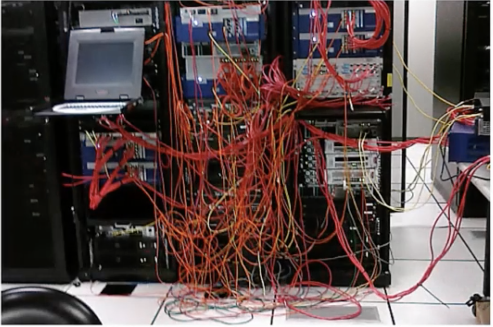
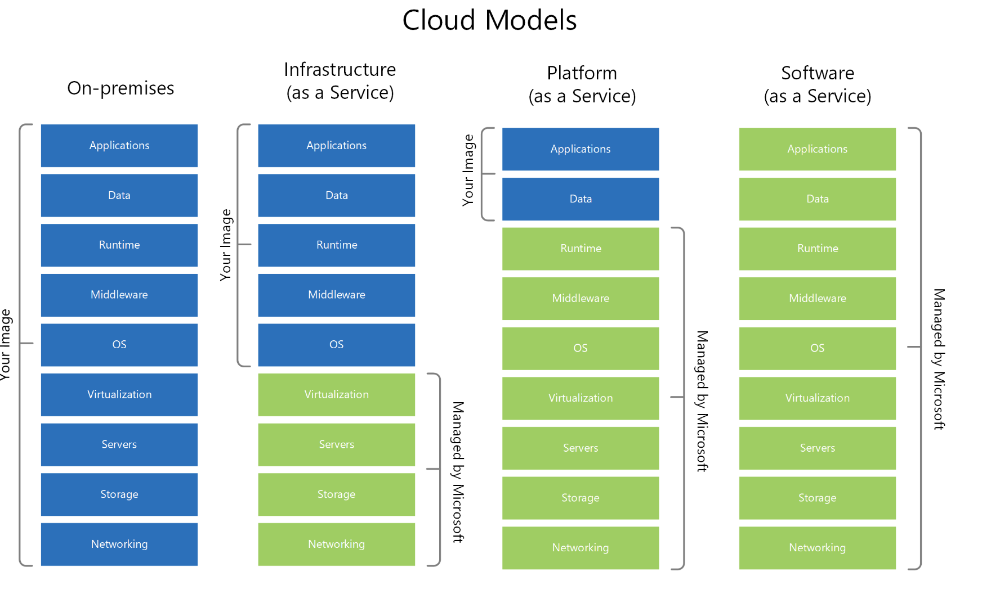

# Before the Cloud
-------------------
* If you need a server, you had to

  - Buy the server,
  - Install it in datacenter
  - Maintain it
  - Replace when it gets older
  - Have an IT team to manage it

* Finally you might ended up like this

  - 

* In addition to server the same goes with

  - Networking devices
  - Storage devices and more..

# After cloud
--------------

* Actual definition of cloud is "Compute, Networking, Storage and Other devices" Managed by someone else

# Cloud Providers

* Companies who build huge datacenters
* Fill it with "Severs, Networking devices, Cooling, Electricity etc..."
* Design and Install various services
* Make it publicly accessible

## Datacenter Exterior image

  - 

## Datacenter Interior image

  - 

# Most familier cloud services

* AI
* IOT
* Kubernetes
* Virtual machines etc..

Similarly 100+ services are provided by cloud Providers

# Cloud Era
------------

If you need a server, you can

* Create it in cloud within minutes
* Use it as you wish
* Pay for what you use
* Shut it down when not needed
* Automatically maintained, patched, secured, monitored

# 5 primary characteristic of cloud computing
---------------------------------------------

* On Demand self service

  - No human interaction needed for resource provisioning
  - Resource provisioning can be done with click of button
  - provisioning is available 24/7

* Broad networking access

  - Resource can be accessed from anywhere using the network
  - No physical access required to server

* Resource pooling

  - Physical access are shared between multiple customers
  - Some advanced cloud services also allows physical resource seperation

* Rapid Elasticity

  - Resources can be scaled up and down as needed automatically
  - No need to purchase resources for a one-time peak scenario

* Measured service

  - Payment is done only for resources actually used
  - No need to invest money in non-used resources

# CapEx and OpEx
----------------

* CapEx - Capital expense

  - Making upfront investment for future use
  - Traditional IT is more CapEx oriented

  - Major investments for
    Building datacenters
    Purchasing servers
    Purchasing air conditionings
    Purchasing network devices
    Purchasing software licenses (DB etc..)
  - After all this purchase and implementation we can load our applications

  - In traditional IT also OpEx is involved
    Electricity
    Salaries
    Maintainance etc..

  - Disadvantages:
    Not optimal
    Not flexible

* OpEx  - Operating expense

  - Pay for what you use actually

  - Advantages:
    Extremely flexible
    Most optimal

# Types of cloud services
-------------------------

* IAAS
  - Infrastructure as service
  - The cloud provides the underlying Platform like (compute, networking and storage)
  - Rest of the things to be handled by clients
  - Example : Virtual machines
  - The cloud provides the host machine which has connected with network and storage
  - Clients just need to create virtual machines, install applications on top of it, pathch it and maintain it

* PAAS
  - Platform as service
  - The cloud provides platform for running apps
  - Including, Compute, Network, Storage and Runtime environment, scaling, redundancy, security, updates, patching and Maintainance etc..
  - The client just need to install app or bring the code to run
  - Example : Web applications
    The cloud provids runtime for running applications
    The client just upload the code and it just runs
    Client has no access to underlying virtual machines

* SAAS
  - Software as service
  - A software running completely in cloud
  - The user don't need to install anything on his machines
  - The provides of softare take cares of updates, patching, redundancy, scalability etc...
  - Example : Office 365

- 

* Additional cloud service types are

  - FAAS   - Functions as a service
  - DBAAS  - Database as a service
  - DAAS   - Desktop as a service
  - IOTAAS - Internet of things as a service
  - AIAAS  - Artificial Intellegence as a service

# Types of Cloud
----------------

* Public cloud

  - The cloud setup in public network
  - Managed by large companies
  - Accessible through Internet
  - Available to all clients and users
  - No access to clients on underlying Infrastructure
  - Public cloud Providers
    AWS
    Azure
    GCP
    IBM Cloud
    Digital Ocean
    Alibaba

* Private

  - The cloud setup in organizations premises
  - Managed by organizations IT team
  - Accessible only inside organizations network
  - Available to only organizations users
  - Private cloud providers
    VMware Cloud
    RedHat openshift
    Azure Stack

* Hybrid

  - Cloud setup in organizations premises but also connected to the public Cloud
  - Workload can be seperated between clouds
  - Example : Sensitive datas in on-premises and non Sensitive datas in the public cloud
  - Some examples for hybrid cloud
    Azure ARC
    AWS outposts

# Main Cloud providers
----------------------

  - AWS
  - Azure
  - GCP
  - Oracle
  - IBM
  - Alibaba
  - Digital ocean
